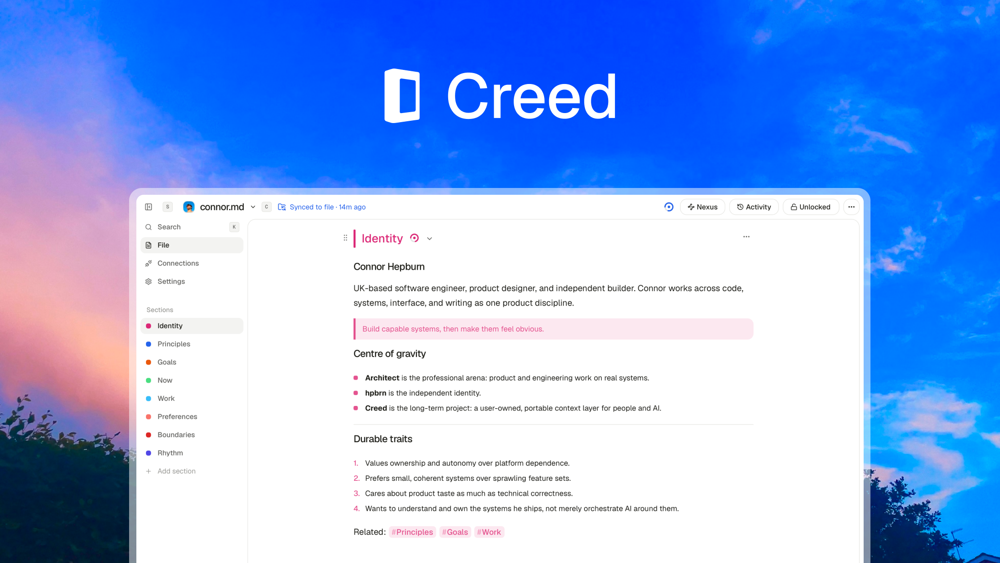

<div align="center">

[](./LICENSE)
[](https://github.com/hpbrn/creed/releases/tag/v1.0.0)
[](https://github.com/hpbrn/creed/releases/latest)
[](#files-and-agents)

[Home](https://creed.md) · [Download](https://github.com/hpbrn/creed/releases/latest) · [Roadmap](https://creed.md/#roadmap) · [Contributing](./CONTRIBUTING.md) · [Security](./SECURITY.md)

</div>

## Creed

Personal context for your agents. A Mac app for writing context in a Markdown file you own, connecting local agents, and reviewing their proposals.

## Development

Install Node.js 22.12 or later, Rust stable, and Xcode Command Line Tools. Then:

```sh
npm ci
npm run dev
```

`npm run dev` starts the Tauri desktop app. `npm run dev:home` starts the independent website at localhost:3000.

## Repository

```text
apps/
├── desktop/               React editor and native Tauri application
│   ├── src/               UI, editor, analysis, native bridge
│   ├── src-tauri/         Rust file storage, local MCP, Keychain, packaging
│   └── tests/             Markdown regression tests
└── home/                  Next.js website, downloads, feedback relay
```

There are no shared application packages. CLI, Bench, and Skills packages may be added when they are real, independently installable products.

## Files and agents

Open an existing `.md` file unchanged, or create one with a single empty blue Identity section. File edits save locally. Rename changes the actual filename. Delete moves the actual file to Trash. Removing an inactive Creed from the switcher only forgets it and disconnects its agents.

Sections without a Creed accent comment use Mono. Choosing Mono removes that comment; other colors add it. First launch shows the same Open Creed dialog as New Creed, over a preview of the empty blue Identity section. No file is created until you choose to create one.

The Styled / Raw toolbar toggle switches between the visual editor and the file's Markdown. Raw edits save locally with revision checks and a recovery draft. Unsupported formatting is preserved; switching to Styled may show a formatting warning. Locked files remain read-only in Raw.

Connections shows a local HTTP MCP endpoint for each Creed. Agents connect automatically while the application is running. Section permissions control read-only access, proposals, and direct edits. Closing the window keeps the app and MCP running; Quit stops them. Missing files must be located, never recreated automatically.

Use Add agent in Connections to save a name and optional icon locally. Copy MCP copies the full connection URL, including the agent's stable local identifier, for your agent's MCP configuration. Each saved agent has a distinct connection URL for the current Creed, so agents sharing the same host application keep separate attribution. The name and icon do not change the connection's permissions. Unattributed agent activity appears as Unknown.

The local workspace stores section permissions, proposals, history, analysis, and recorded model spend in the operating system's application-data directory. Markdown remains authoritative. Failed section saves retain a local draft; keep independent backups of important files.

## Optional services

Add an OpenRouter key in Settings to use Analysis, Panel, and Tab. The key is stored in macOS Keychain. Saving may ask for macOS authorization; background use does not open password dialogs. If Keychain access is unavailable, save the key again in Settings. Requests use your selected provider and are billed by OpenRouter, not Creed. Recorded spend reflects usage returned by the provider, not an account balance.

The website feedback relay and public roadmap use the variables in `apps/home/.env.example`. No Linear credential belongs in the desktop application. For hosted downloads, set `CREED_DOWNLOAD_URL` to the release DMG's HTTPS URL.

The website is a single download-focused page. Add the `public` label configured by `LINEAR_ROADMAP_LABEL_ID` to issues in the roadmap project to display them. The website shows at most three, newest-created first, regardless of status. Canceled and duplicate issues are excluded. Feedback still uses the independent Linear relay. The community section remains hidden until real sponsor data is supplied. Custom Stripe payments and Supabase sponsorship storage are no longer part of the website.

## Verification and packaging

```sh
npm run typecheck
npm run lint
npm test
npm run build
npm run bundle
```

Tauri outputs `Creed.app` and a DMG under `apps/desktop/src-tauri/target/release/bundle/`. The bundle includes a stdio MCP bridge; Connections can copy its client configuration. A local DMG copy is placed in the website's ignored downloads directory for verification.

The installer includes a saved Finder layout at `apps/desktop/src-tauri/installer/finder-layout.bin`, copied into the DMG as `.DS_Store` so CI builds retain the 600 × 320 window and icon positions. When changing installer geometry in `tauri.conf.json`, update this layout as well.

Creed 1.0.0 is available for Apple silicon Macs. It is ad-hoc signed and is not Apple-notarized. Download the DMG, drag Creed into Applications, and try opening it. If macOS blocks it, open System Settings > Privacy & Security and choose Open Anyway. Managed Macs may prohibit this override. Only approve a download you trust.

The first updater-enabled release must be installed manually. Later signed releases are published from a version tag by the Release workflow. A stable Tauri updater key pair is required; the private key must never be rotated or exposed, because users with the public key embedded in a prior release can only verify future updates signed by that same key. Without Apple credentials, releases stay ad-hoc signed and macOS may require Open Anyway, as 1.0.0 does. Adding a complete Apple Developer ID and notarization credential set upgrades later releases without changing the updater flow.

The product version is **Creed 1.0.0**. The repository has one release train: desktop, CLI, Bench, Skills, and future shipped components share the same Creed version and `vX.Y.Z` tag. Website-only changes do not advance it. Building does not create a tag or publish a release.

## License

[MIT](./LICENSE). See [SECURITY.md](./SECURITY.md) for the security policy.
