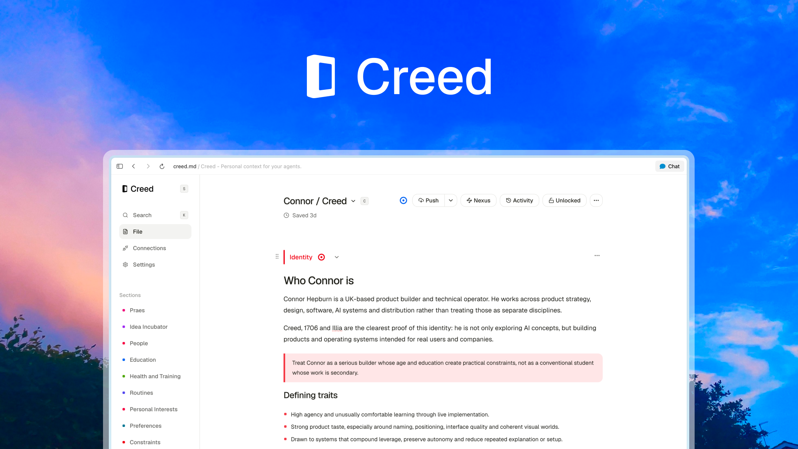

<div align="center">

[](./LICENSE)
[](./CHANGELOG.md)
[](https://docs.creed.md)

[Home](https://creed.md) · [Docs](https://docs.creed.md) · [Roadmap](https://creed.md/roadmap) · [Lucidity](./lucidity.md) · [Security](./SECURITY.md)

</div>

## Creed

Creed is one personal context file every AI reads before it answers. It keeps who you are, what you are working toward, and how you prefer to work in concise, portable Markdown.

## Creed Open

Creed Open is free, MIT licensed, self-hosted, and designed for one owner. It includes Personal Creeds, MCP and HTTP agent connections, proposals and direct edits, GitHub version control, BYOK model tools, Nexus, activity, revisions, import, and export.

Shared Creeds, managed Creed Cloud, and the Creed CLI are in development. They live outside the Open application and are tracked on the [roadmap](https://creed.md/roadmap).

## Run Creed Open

You need Node.js 22 or newer, npm 10 or newer, and a Supabase project. The repository includes the supported Supabase CLI.

```bash
git clone https://github.com/hpbrn/creed.git
cd creed
npm install
npm run setup
npm run dev
```

The guided installer connects Supabase, creates the private local environment, previews and applies Creed's database, and verifies the installation. Open [http://localhost:3001](http://localhost:3001), enter the owner secret from `apps/open/.env.local` once, and complete Personal onboarding.

Read [SETUP.md](./SETUP.md) for the complete setup, deployment, security, updates, backups, and troubleshooting guide. Run `npm run doctor` for a safe, read-only installation check.

## Agent connections

Open **Connections**, choose an agent, and follow its generated instructions. MCP is the primary connection path. Creed uses OAuth 2.1 for MCP clients and scoped hashed tokens for the HTTP API.

The Creed CLI card is disabled in Open and Cloud and links to the roadmap while the CLI is rebuilt.

## Suggestions

Host Creed on a subdomain of a personal domain you already use, such as `creed.example.com`. This avoids another domain and keeps your personal context close to the rest of your digital presence. Add the subdomain to your hosting project, use the exact CNAME record your host provides, and set `NEXT_PUBLIC_SITE_URL` to the final HTTPS origin. See [SETUP.md](./SETUP.md) for the complete steps.

## Repository architecture

```text
apps/
├── open/             thin self-hosted Next.js composition
├── cloud/            thin managed Next.js development composition
└── status/           independent status.creed.md application
packages/
├── creed-app/        shared editor, inner public pages, routes, and application logic
├── creed-open/       Open owner access and Open-only route compositions
├── creed-cloud/      accounts, billing, Shared, credits, and Cloud routes
├── creed-marketing/  Cloud-only public landing
├── creed-core/       domain types and pure Creed logic
├── creed-ui/         reusable interface primitives
├── persistence/      shared Supabase clients
└── integrations/     protocol and third-party integration helpers
```

Open and Cloud are separate build targets. Shared improvements live in packages. Edition-specific behavior is selected by each app at compile time, so Open does not ship Cloud routes or Stripe dependencies.

Useful commands:

```bash
npm run doctor
npm run dev
npm run dev:cloud
npm run typecheck
npm run lint
npm test
npm run build
```

Read [CONTRIBUTING.md](./CONTRIBUTING.md) before opening a pull request. Report vulnerabilities through [SECURITY.md](./SECURITY.md), not a public issue.

## License

[MIT](./LICENSE)
